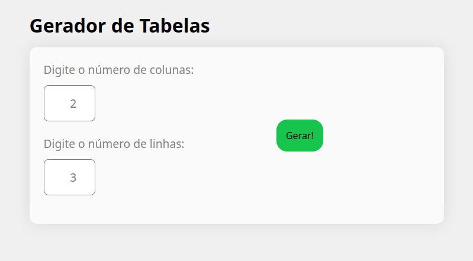
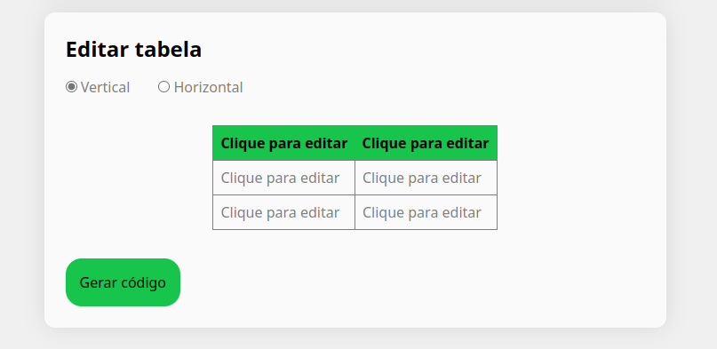
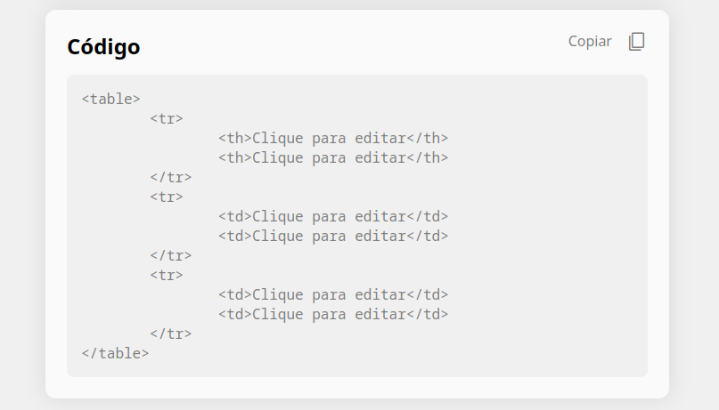

# Gerador de tabelas

Sabe quando você precisa criar uma tabela em HTML? Não dá um trabalhão digitar TRs e TDs? Esse projeto de ajuda a simplificar esse processo. Basta definir o número de linhas e colunas e a tabela é gerada.

## Como Usar

É muito simples usar o Gerador de Tabelas. Primeiro, defina o número de linhas e colunas e clique no botão "Gerar!"

Depois, uma tabela é gerada na página. Basta clicar em cada célular para editar seu conteúdo.

Nessa tela você deve ainda selecionar se a tabela é no sentido vertical (com os títulos da tabela na primeira linha) ou horizontal (com os títulos na primeira coluna). O padrão é o sentido vertical.

Por fim, quando você clicar no botão "Gerar código", o código é exibido para você. Você pode selecionar o texto e copiá-lo ou clicar em "Copiar".

## Github Pages

O projeto está disponível através do [Github Pages](https://renansantos7.github.io/Gerador-de-tabelas/)